# flask-devops-project-L1
Building and Deploying a Simple Flask applications using Jenkins and Kubernetes

In this project, we are going to build a simple [CI/CD](https://www.atlassian.com/continuous-delivery/principles/continuous-integration-vs-delivery-vs-deployment) pipeline from scratch using tools like Flask, Docker, Git, Github, Jenkins and Kubernetes.
 
## Prerequisites
 
* Python
* Flask
* Docker
* Git and Github
* Jenkins
* Kubernetes
* Linux machine
 
## Steps in the CI/CD pipeline
1. Create a "Hello world" Flask application
2. Write basic test cases
3. Dockerise the application
4. Test the code locally by building docker image and running it
5. Create a github repository and push code to it
6. Start a Jenkins server on a host
7. Write a Jenkins pipeline to build, test and push the docker image to Dockerhub.
8. Set up Kubernetes on a host using [Minikube](https://minikube.sigs.k8s.io/docs/start/)
9. Create a Kubernetes deployment and service for the application.
10. Use Jenkins to deploy the application on Kubernetes
 
## Project structure
 
* app.py - Flask application which will print "Hello world" when you run it
* test.py - Test cases for the application
* requirements.txt - Contains dependencies for the project
* Dockerfile - Contains commands to build and run the docker image
* Jenkinsfile - Contains the pipeline script which will help in building, testing and deploying the application
* deployment.yaml - [Kubernetes deployment](https://kubernetes.io/docs/concepts/workloads/controllers/deployment/) file for the application
* service.yaml - [Kubernetes service](https://kubernetes.io/docs/concepts/services-networking/service/) file for the application


### Clone my Github repository to local host.

 ```powershell
git clone https://github.com/Gahoo82/flask-devops-project-L1.git
 ```
 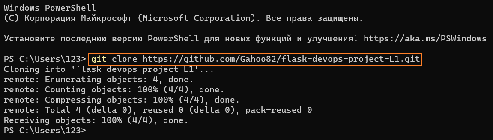
 
 ### Set up virtual Python environment

 Setting up a [virtual Python environment](https://docs.python.org/3/library/venv.html) will help in testing the code locally and also collecting all the dependencies.
 
```powershell
> py -m venv venv # Create the virtual env named venv
> venv/Scripts/activate # Activate the virtual env
```
 
## Create a Flask application
 
Install the flask module.
 
```powershell
> pip install flask
```
Open cloned "flask-devops-project-L1" repository in Visual Studio Code.
Create a new file named "app.py" and add the below code.
 
```python
from flask import Flask
import os
 
app = Flask(__name__)
 
 @app.route("/")
def hello():
   return "Hello world!!!"
  
if __name__ == "__main__":
   port = int(os.environ.get("PORT", 5000))
   app.run(debug=True, host='0.0.0.0', port=port)
```
 
This code when run will start a web server on port number 5000. 
 
```powershell
> python app.py
```

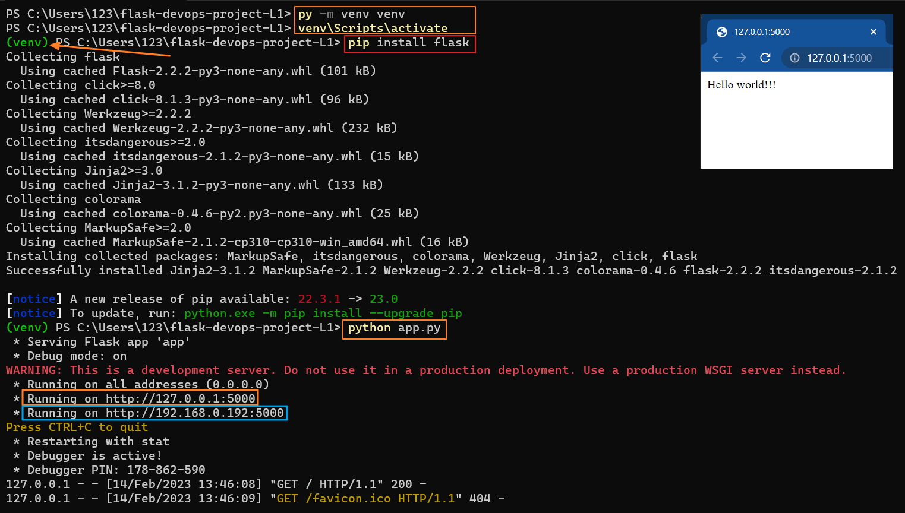

## Write test cases using pytest
 
Install [pytest](https://docs.pytest.org/en/7.1.x/) module. We will use pytest for testing.
 
```powershell
> pip install pytest
```

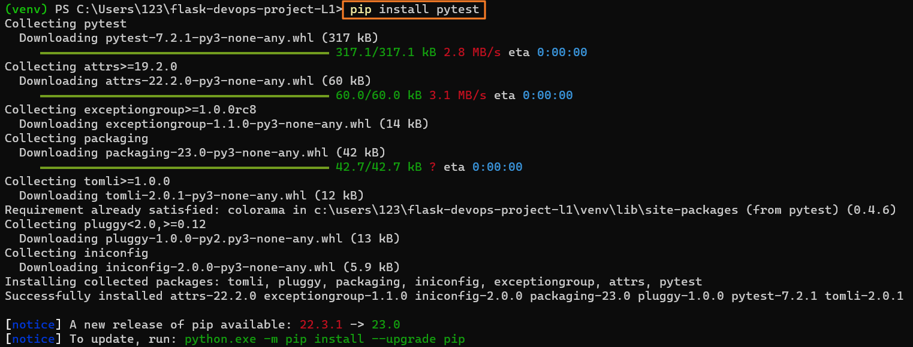

Create a new file named "test.py" and add a basic test case.
 
```python
from app import app
 
def test_hello():
   response = app.test_client().get('/')
   assert response.status_code == 200
   assert response.data == b'Hello world!!!'
```
 
Run the test file using pytest.
 
```powershell
> pytest test.py
```

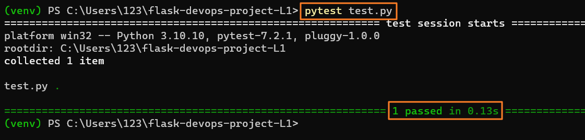

## Run code quality tests using flake
 
It's always recommended to write quality code with proper coding standards, proper code formatting and code with no syntax errors.
 
[Flake8](https://flake8.pycqa.org/en/latest/) can be used to check the quality of the code in Python.
 
Install the flake8 module.
 
```powershell
> pip install flake8
```
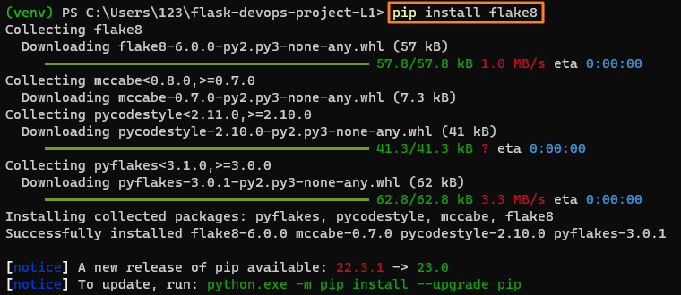
 
Run flake8 command.
 
```powershell
> flake8 --exclude venv # Ignore files in venv for quality check
```
 
If you do not see any output, it means that everything is alright with code quality.
 
Try add extra spaces in the app.py and then run flake8 command again. You should see the errors.

Remove extra spaces and we will not see the errors now.

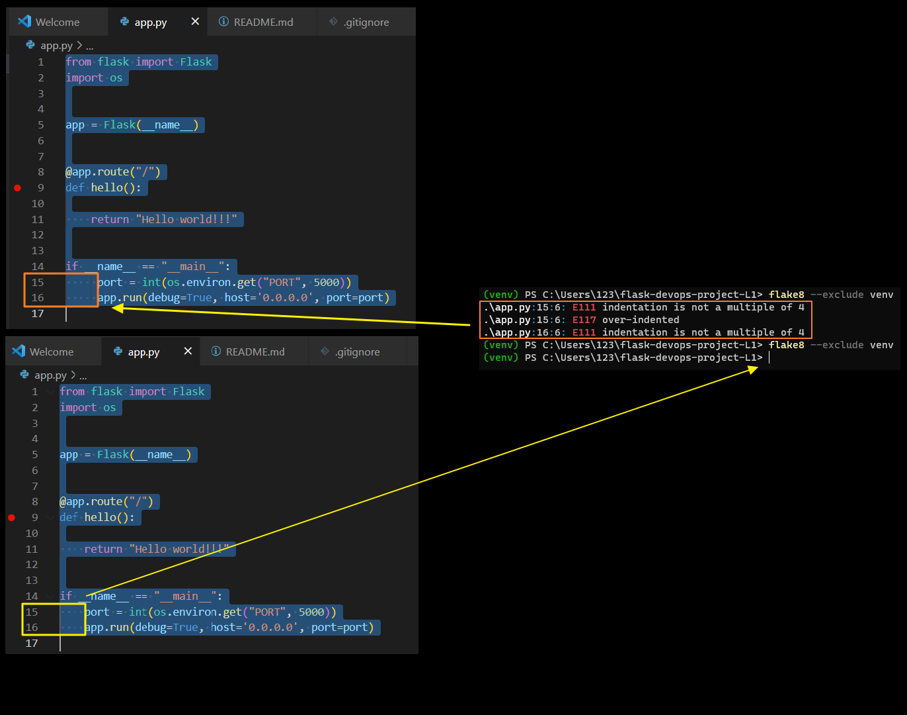


## Dockerise the application
 
Install docker on local system. Following [https://docs.docker.com/get-docker/](https://docs.docker.com/get-docker/)
 
Create a file named "Dockerfile" and add the below code.
 
```dockerfile
FROM python:3.10
LABEL maintainer="chernenko.kostua@gmail.com"
COPY app.py test.py /app/
WORKDIR /app
RUN pip install flask pytest flake8 # This downloads all the dependencies
CMD ["python", "app.py"]
```
 
Build the docker image.
 
```powershell
> docker build -t flask-hello-world .
```
 
Run the application using docker image.
 
```powershell
> docker run -it -p 5000:5000 flask-hello-world
```

 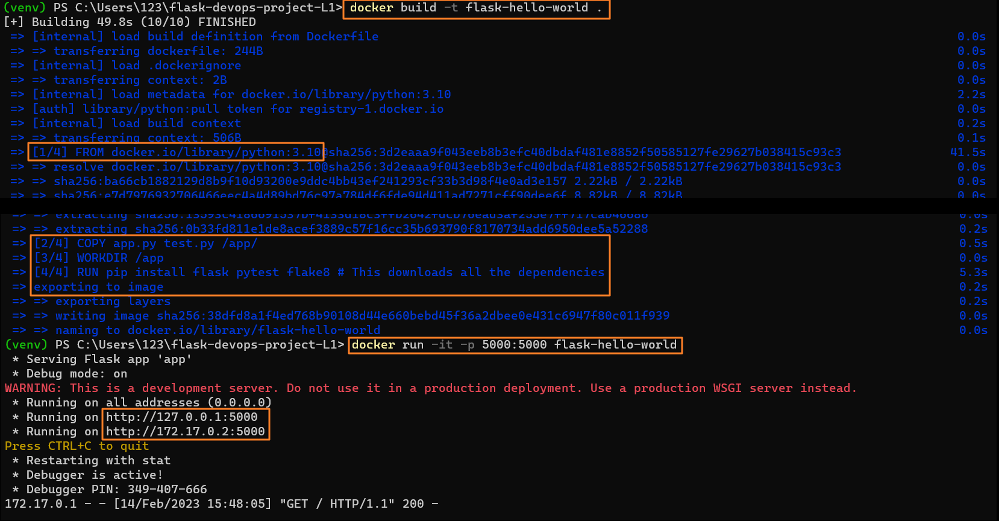

Run test case
 
```powershell
> docker run -it flask-hello-world pytest test.py
```
 
Run flake8 tests
 
```powershell
> docker run -it flask-hello-world flake8
```
 
We can verify if the application is running by opening the page in the browser.
 
Push the image to dockerhub. We will need an account on docker hub for this.
 
```powershell
> docker login # Login to docker hub
> docker tag flask-hello-world gahoo82/flask-hello-world
docker push gahoo82/flask-hello-world
```

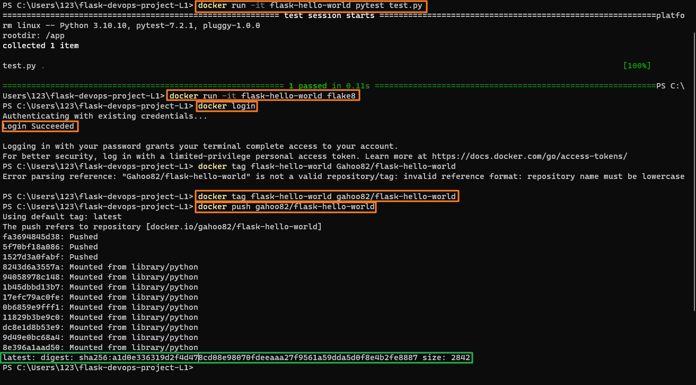
 
## Push the code to github


## Install Jenkins
 
Next we will launch EC2 instance on AWS with Ubuntu 22.04 will install Jenkins on that instance. 
[https://phoenixnap.com/kb/install-jenkins-ubuntu](https://phoenixnap.com/kb/install-jenkins-ubuntu).

 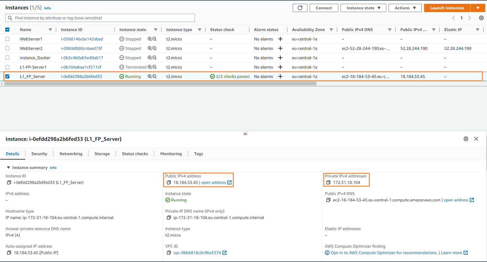

Create Key pair and Security Group

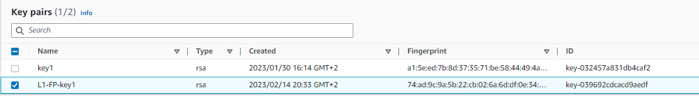


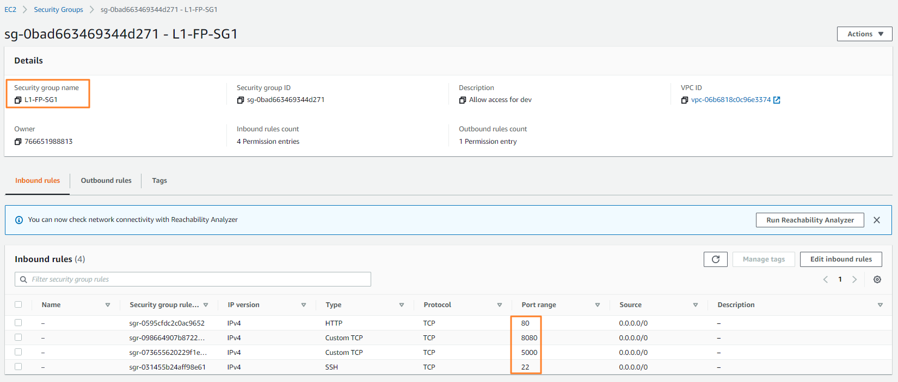

Download private key to local host and connect to EC2 instance with Powershell via SSH.

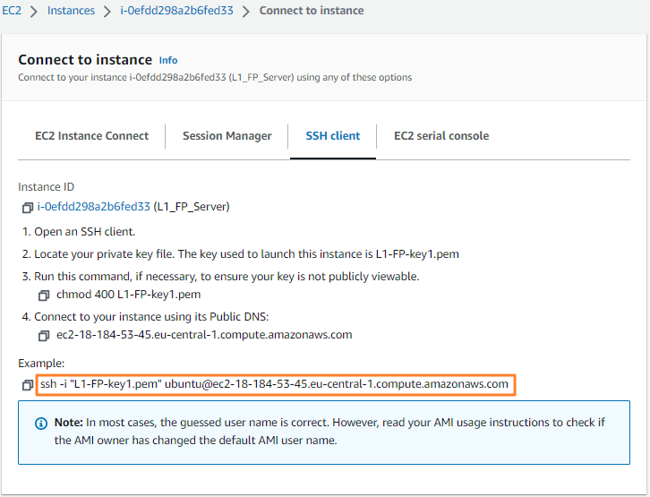

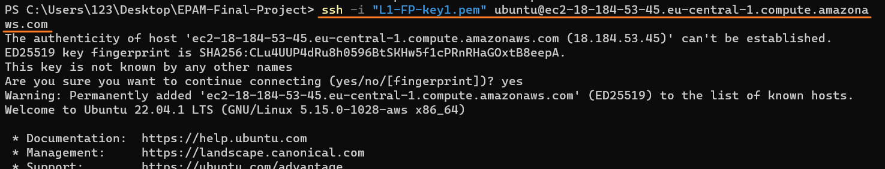

 
Run the following commands on the server.
 
```powershell
# Install jenkins
 
> curl -fsSL https://pkg.jenkins.io/debian-stable/jenkins.io.key | sudo tee \
/usr/share/keyrings/jenkins-keyring.asc > /dev/null
 
> echo deb [signed-by=/usr/share/keyrings/jenkins-keyring.asc] \
https://pkg.jenkins.io/debian-stable binary/ | sudo tee \
/etc/apt/sources.list.d/jenkins.list > /dev/null
 
> sudo apt-get update
> sudo apt install openjdk-11-jre
> sudo apt-get install jenkins
 
# Install docker and add jenkins user to docker group
# Installing docker is important as we will be using jenkins to run docker commands to build and run the application.
> sudo apt install docker.io
> sudo usermod -aG docker jenkins
> sudo service jenkins restart
```
 
Open browser and visit [http://18.184.53.45:8080/](http://18.184.53.45:8080/)] - public address of the EC2 instance.
 
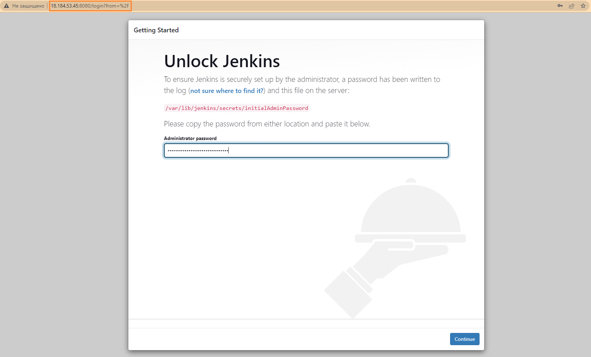
 
Copy the admin password from the path provided on the jenkins homepage and enter it. Click on "Install suggested plugins". It will take some time to install the plugins.
 
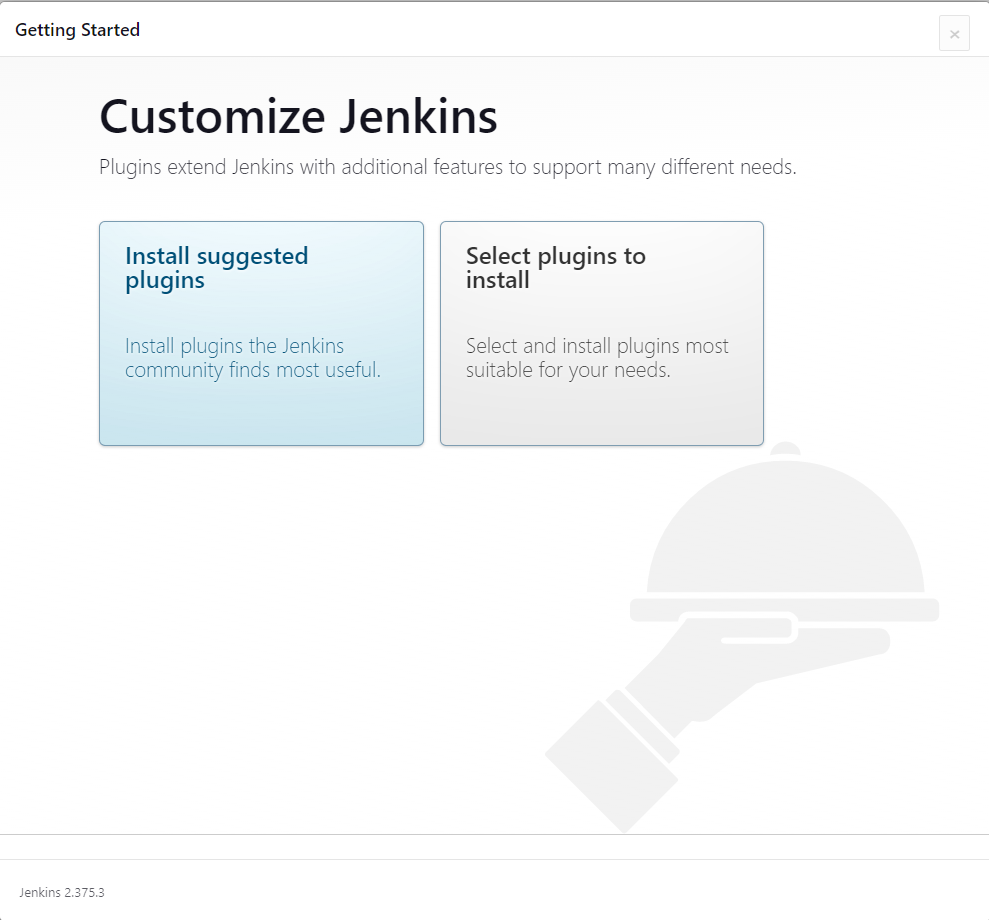
 
Create a new user.
 
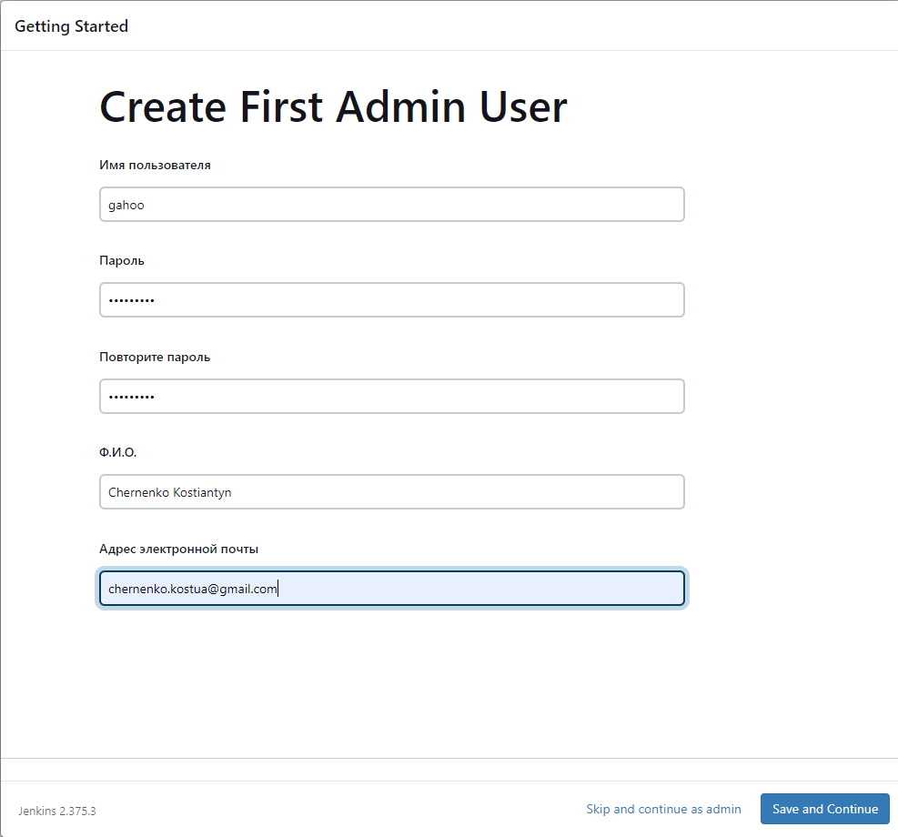
 
You should now see the jenkins url. Click next and you should see the "Welcome to jenkins" page now.
 
## Create a Jenkins pipeline
 
We will now create a Jenkins pipeline which will help in building, testing and deploying the application.
 
Click on "Создать Item" on the top left corner of the homepage.
 
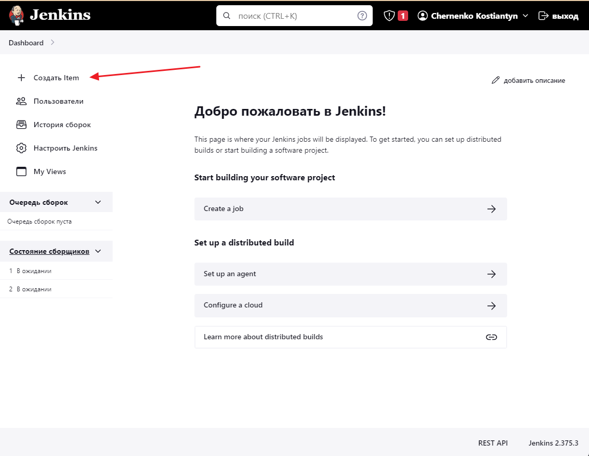
 
Enter a name, select "Pipeline" and click next.
 
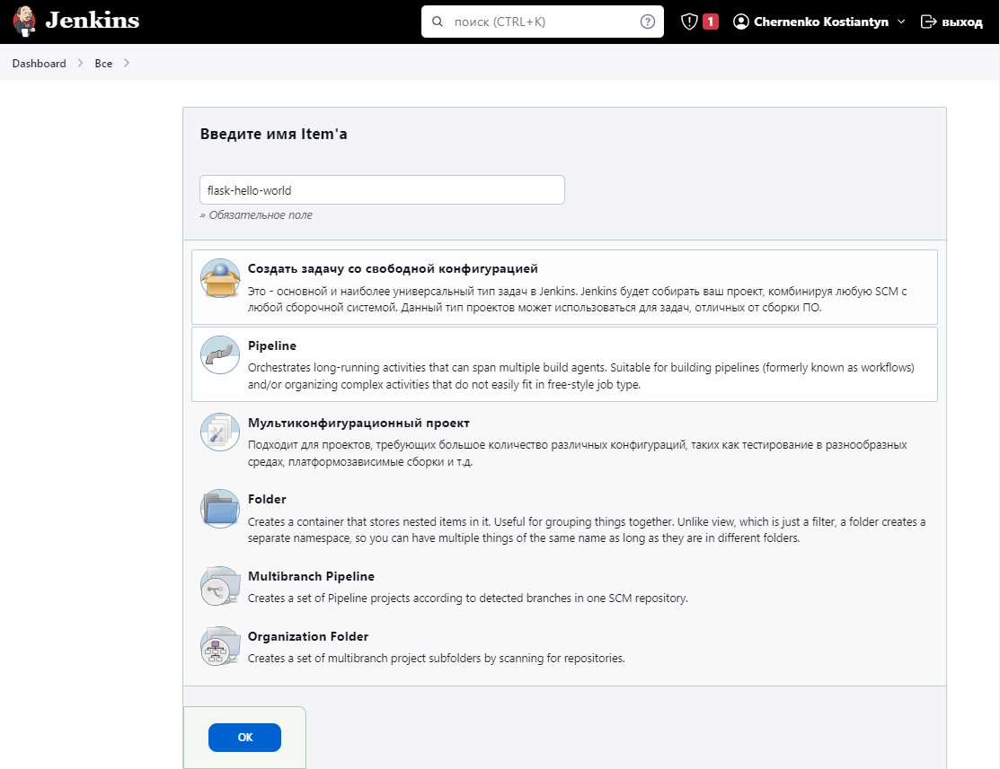
 
Now we need to write a [pipeline script](https://www.jenkins.io/doc/book/pipeline/syntax/) in Groovy for building, testing and deploying code.
 
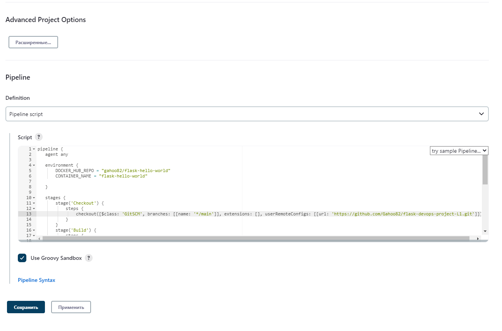
 
Enter the below code in the pipeline section and click on "Save".
 
```
pipeline {
   agent any
  
   environment {
       DOCKER_HUB_REPO = "gahoo82/flask-hello-world"
       CONTAINER_NAME = "flask-hello-world"
 
   }
  
   stages {
       stage('Checkout') {
           steps {
               checkout([$class: 'GitSCM', branches: [[name: '*/main']], extensions: [], userRemoteConfigs: [[url: 'https://github.com/Gahoo82/flask-devops-project-L1.git']]])
           }
       }
       stage('Build') {
           steps {
               echo 'Building..'
               sh 'docker image build -t $DOCKER_HUB_REPO:latest .'
           }
       }
       stage('Test') {
           steps {
               echo 'Testing..'
               sh 'docker stop $CONTAINER_NAME || true'
               sh 'docker rm $CONTAINER_NAME || true'
               sh 'docker run --name $CONTAINER_NAME $DOCKER_HUB_REPO /bin/bash -c "pytest test.py && flake8"'
           }
       }
       stage('Deploy') {
           steps {
               echo 'Deploying....'
               sh 'docker stop $CONTAINER_NAME || true'
               sh 'docker rm $CONTAINER_NAME || true'
               sh 'docker run -d -p 5000:5000 --name $CONTAINER_NAME $DOCKER_HUB_REPO'
           }
       }
   }
}
```
 
Click on the "Собрать сейчас" button at the left of the page.
 
The pipelines should start running now and you should be able to see the status of the build on the page.
 
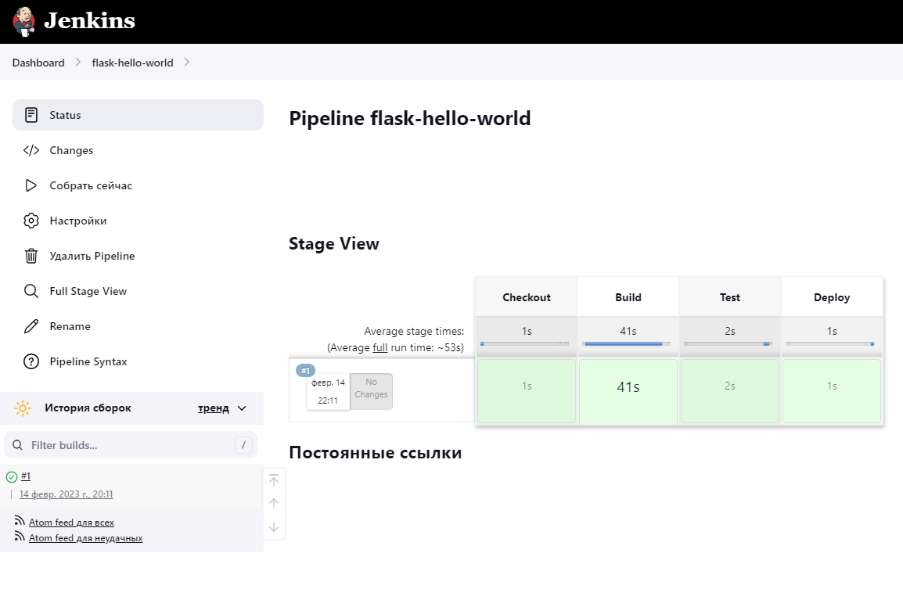
 
If the build is successful, we can visit [http://18.184.53.45:5000](http://18.54.53.45:5000) and we should see "Hello world" on the browser. 

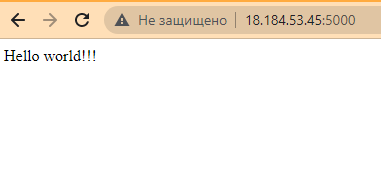
 
## Pipeline script from SCM
 
We can also store the Jenkins pipeline code in our github repository and ask Jenkins to execute this file.
 
Go to the "flask-hello-world" pipeline page and click on "Настройки".
 
Change definition from "Pipeline script" to "Pipeline script from SCM" and fill details on SCM and github url. Save the pipeline.
 
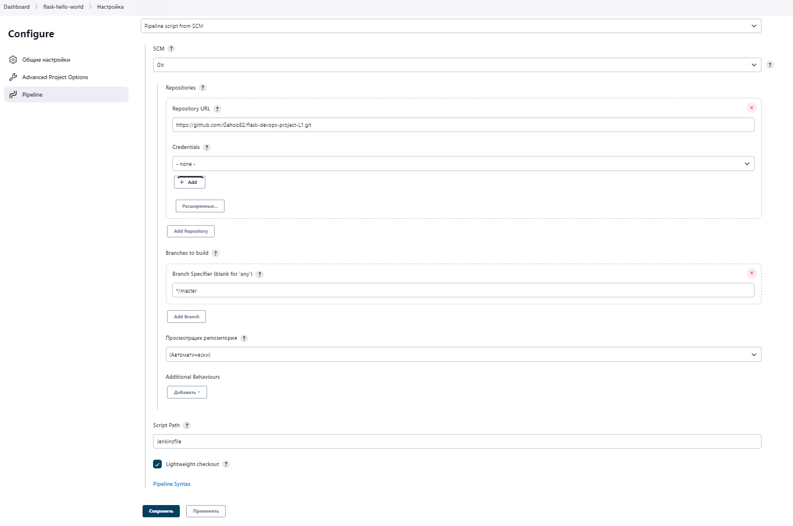
 
Now, create a new file named "Jenkinsfile" in our local code repository and add the below pipeline code.
 
```
pipeline {
   agent any
  
   environment {
       DOCKER_HUB_REPO = "gahoo82/flask-hello-world"
       CONTAINER_NAME = "flask-hello-world"
 
   }
  
   stages {
       /* We do not need a stage for checkout here since it is done by default when using the "Pipeline script from SCM" option. */
      
 
       stage('Build') {
           steps {
               echo 'Building..'
               sh 'docker image build -t $DOCKER_HUB_REPO:latest .'
           }
       }
       stage('Test') {
           steps {
               echo 'Testing..'
               sh 'docker stop $CONTAINER_NAME || true'
               sh 'docker rm $CONTAINER_NAME || true'
               sh 'docker run --name $CONTAINER_NAME $DOCKER_HUB_REPO /bin/bash -c "pytest test.py && flake8"'
           }
       }
       stage('Deploy') {
           steps {
               echo 'Deploying....'
               sh 'docker stop $CONTAINER_NAME || true'
               sh 'docker rm $CONTAINER_NAME || true'
               sh 'docker run -d -p 5000:5000 --name $CONTAINER_NAME $DOCKER_HUB_REPO'
           }
       }
   }
}
```
 
Push the code to github.
 
 
Go to "flask-hello-world" pipeline page and click on "Build Now"
 
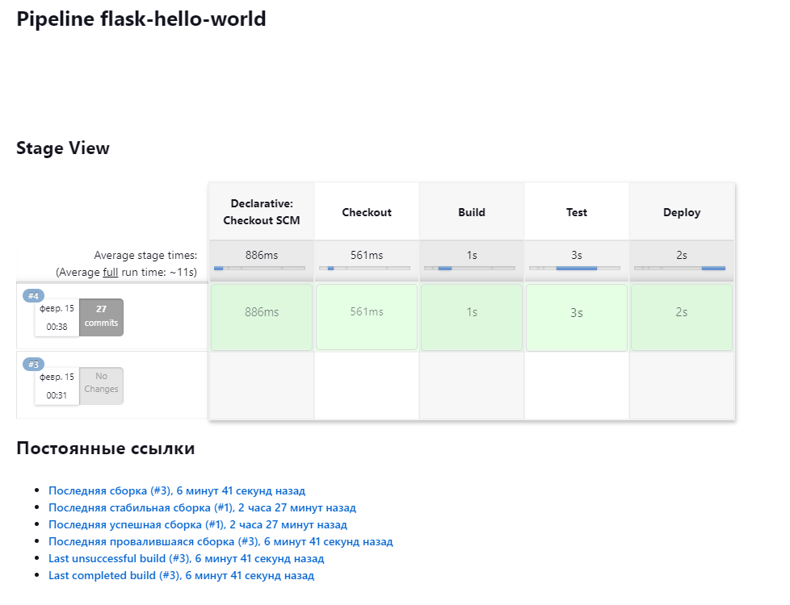

